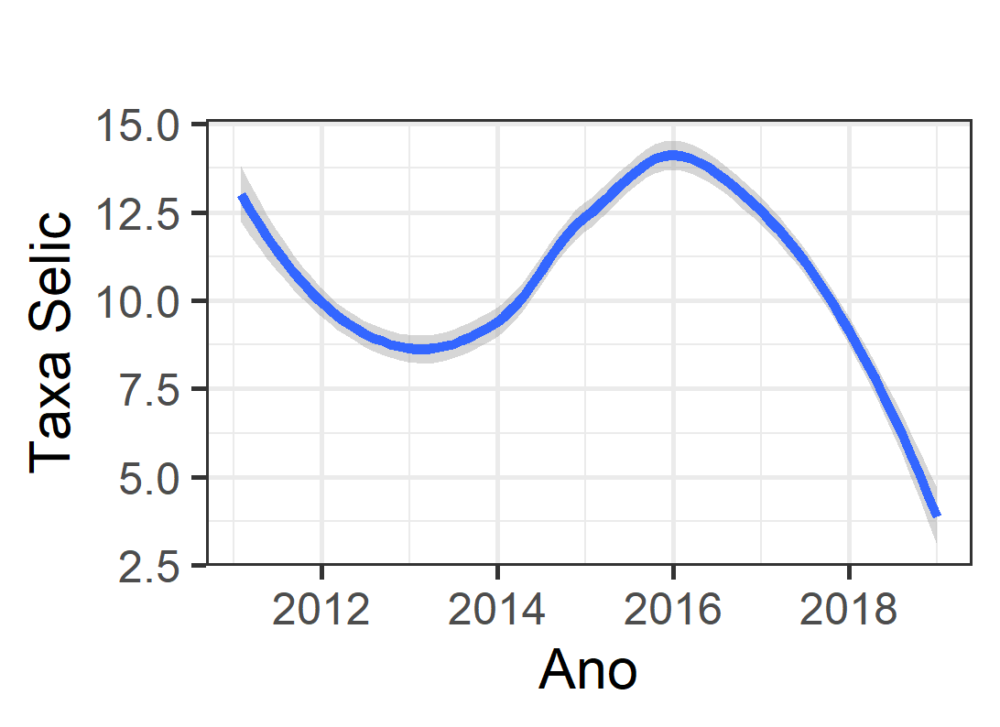
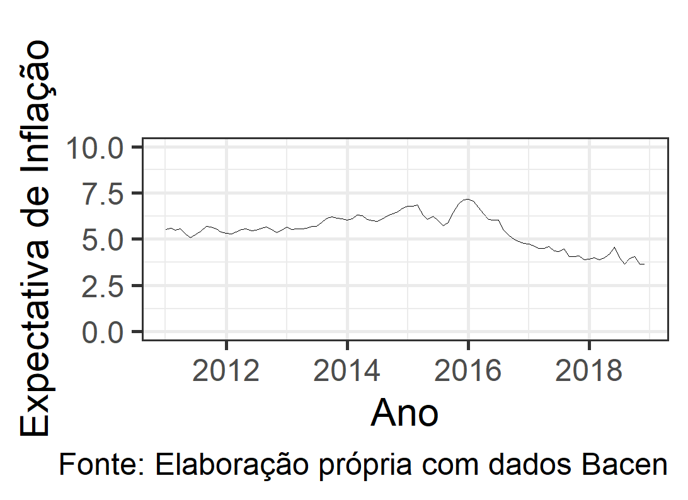

# credibility_monetary_policy

Este projeto foi a minha monografia, defendida no ano de 2019, no Instituto de Economia da UFRJ (IE-UFRJ).

## Objetivos

Projeto que visa entender como a credibilidade da política monetária e a selic se relacionam. Quais os efetios de ter mais credibilidade sobre a selic? Quais os efeitos de ter menos credibilidade sobre a selic?

## Estratégia Empírica

Para escolher a melhor metodologia que nos permita estudar as relação entre as variáveis, precisamos checar algumas
características dos dados (variáveis de interesse). Fazendo isso, percebemos que ambas as variáveis possuem tendência. Portanto, não podemos utilizar o modelo VAR tradicional. Nestas ocasiões, o mais adequado, dada a estrutura dos dados e a natureza do projeto, o modelo mais adequado seria o Vetor de Correções de Erros (VEC), ou, em inglês, Vector Correction Model (VECM). A principal exigência deste modelo é que awdqwds variáveis de interesse compartilhem a mesma tendência. Para checar tal condição, fizemos uso do teste de cointegração de Johansen.
d
## Dados

Foi utilizado os dados da taxa selic e de expectativa de inflação. Para construir os índices de credibilidade, foi feito uso dos desvios das expectativas de inflação em relação à meta de inflação, seguindo a metodologia de cada autor. Os índices calculados são (i) índice de Cecchetti & Krause, (ii) índice de Mendonça [2007] e , (iii) índice de Sicsú.

## Pacotes Utilizados

Foram usados os seguintes pacotes:

* `ggplot`(Visualização de dados);
* `Quandl`(Importar dados);
* `Tidyverse`(Manipulação);
* `vars`(Modelo Econométrico);
* `readxl` (Importar dados);
* `het.test`(Testes Estatísticos);

OBS: o pacote `het.test` foi utilizado para realizar o teste de White de Heterocedasticidade, conforme descrito por Doornik (1996). Porém, o pacote não se encontra disponível mais no `CRAN`.

## Visualização de dados

Trajetória da Taxa Selic no período de interesse:

Trajetória das Expectativas de Inflação no período de interesse:

